# Laboratoria
## Proyecto 2: Hipótesis
Se busca validar y refutar hipótesis con la finalidad de saber que es lo que le puede dar el exito a un artista o a una canciónEste proyecto tiene como objetivo validar y refutar hipótesis para identificar los factores que pueden contribuir al éxito de un artista o una canción. A través del análisis de datos y el uso de pruebas estadísticas, se busca entender las variables que influyen en el desempeño en plataformas de streaming y otros indicadores de popularidad musical.

# Temas
- [Introducción](#introducción)
- [Herramientas](#herramientas)
- [Lenguajes](#lenguajes)
- [Procesamiento y preparación de datos](#procesamiento-y-preparación-de-datos)
- [Visualización y Análisis de Datos](#visualización-y-análisis-de-datos)
- [Resultados](#resultados)
- [Correlación entre variables](#correlación-entre-variables)
- [Prueba de Significancia](#prueba-de-significancia) 
- [Conclusiones y recomendaciones](#conclusiones-y-recomendaciones)
- [Recursos](#recursos)

  ## Introducción
El objetivo de este proyecto es aumentar las posibilidades de éxito de la discográfica y del nuevo artista mediante el análisis de una base de datos de Spotify. Para lograr esto, se busca refutar o confirmar las siguientes hipótesis:
- Las canciones con un mayor BPM (Beats Por Minuto) tienen más éxito en términos de cantidad de streams en Spotify.
- Las canciones más populares en el ranking de Spotify también tienen un comportamiento similar en otras plataformas como Deezer.
- La presencia de una canción en un mayor número de playlists se relaciona con un mayor número de streams.
- Los artistas con un mayor número de canciones en Spotify tienen más streams.
- Las características de la canción influyen en el éxito en términos de cantidad de streams en Spotify.
Y por último, proporcionar recomendaciones estratégicas basadas en los hallazgos.

### Trabajo en dupla
- Alejandra Martínez 
- Verónica Domínguez

## Herramientas
- BigQuery
- Power BI
- Google Colab

## Lenguajes
- SQL en BigQuery 
- Python en Google Colab

## Procesamiento y preparación de datos
1. Importación y Creación de Tablas en BigQuery:
- Proyecto: Proyecto_Spotify
- Tablas importadas: track_in_competition, track_in_spotify, track_technical_info
2. Identificación y Manejo de Valores Nulos:
- track_in_competition: 50 nulos en in_shazam_charts
- track_technical_info: 95 nulos en key
- Consultas SQL utilizadas para contar valores nulos en cada columna de las tablas.
3.  Manejo de Valores Duplicados:
- Identificación de duplicados principalmente en track_in_spotify.
- Consultas SQL para contar valores duplicados en cada tabla.
4.  Eliminación de Valores Fuera del Alcance del Análisis:
- Eliminación de columnas irrelevantes (key, mode) en track_technical_info.
- Consultas SQL para excluir columnas.
5. Identificación y Manejo de Datos Discrepantes:
- Manejo de símbolos en track_in_spotify mediante expresiones regulares.
- Identificación de discrepancias en valores numéricos utilizando funciones MAX, MIN y AVG.
6. Cambio de Tipos de Datos:
- Conversión de streams de STRING a INTEGER en track_in_spotify.
- Consultas SQL para realizar los cambios de tipo de datos.
7. Creación de Nuevas Variables:
- Creación de la variable release_date en track_in_spotify.
- Consultas SQL para concatenar y formatear fechas.
8. Unión de Tablas:
- Limpieza y creación de vistas con datos limpios para cada tabla.
- Unión de las tablas limpias (track_in_spotify, track_in_competition, track_technical_info) mediante LEFT JOIN.
9. Construcción de Tablas Auxiliares:
- Uso de tablas temporales para analizar el total de canciones por artista y la participación en playlists.
- Consultas SQL con la estructura WITH para crear estas tablas auxiliares.
  
## Visualización y Análisis de Datos
### Visualización de la Distribución
Se crearon dos histogramas en Power BI utilizando Python.
- **Histograma de Playlists:** Muestra la frecuencia de playlists según una variable específica. La mayoría de las playlists se concentran en el primer intervalo, indicando una gran cantidad de playlists con valores bajos en esta variable.
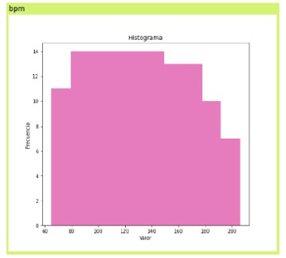

- **Histograma de BPM:** Muestra la distribución de BPM en el conjunto de datos. Los BPM varían entre 75 y 200, con una mayor concentración en los rangos más bajos. Esto sugiere que las canciones con BPM más lentos son más comunes en el conjunto de datos.
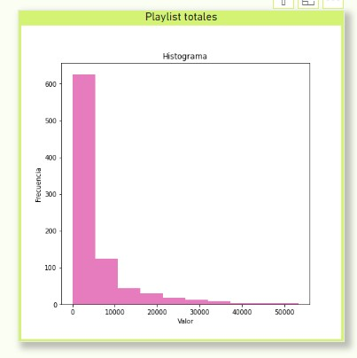

## Resultados
## Correlación entre variables
- **Hipótesis 1**
- **Correlación streams vs bpm:** -0.0023362

   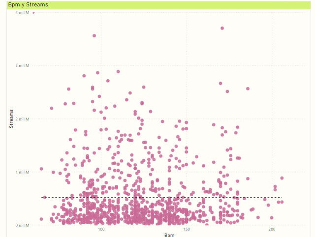
  - *Interpretación:* No hay correlación entre el éxito de la canción (medido por el número de streams) y los beats por minuto (bpm) de la canción.
- **Hipótesis 2**
- **Correlación Spotify vs Deezer charts:** 0.6051478
  
   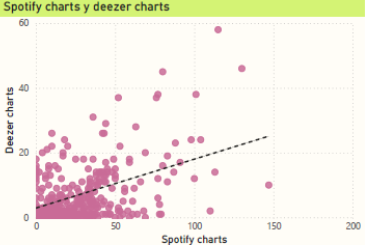
  - *Interpretación:* Sí hay correlación entre las canciones populares de Spotify y las de Deezer.
- **Correlación Spotify vs Apple charts:** 0.55180145

   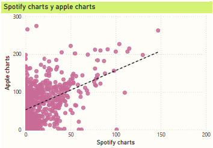
  - *Interpretación:* Sí hay correlación entre las canciones populares de Spotify y las de Apple Music.
- **Correlación Spotify vs Shazam charts:** 0.6055872
 
   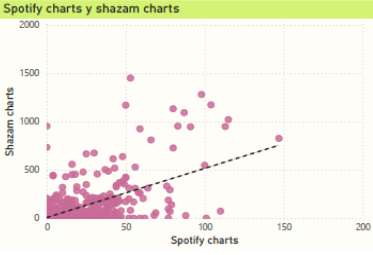
   - *Interpretación:* Sí hay correlación entre las canciones populares de Spotify y las de Shazam.
- **Hipótesis 3**
- **Correlación Streams vs Playlist:** 0.79458876

   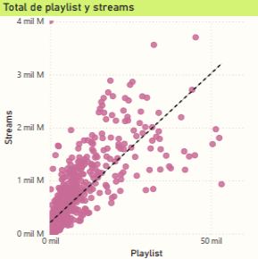
    - *Interpretación:* Sí hay correlación entre que una canción salga en más playlists y sus números de streams.
- **Hipótesis 4**
- **Correlación Streams vs Total de canciones por artista:** 0.8027135
  
   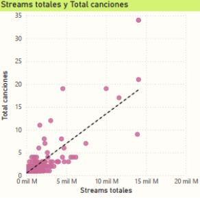
    - *Interpretación:* Sí hay correlación entre el número de canciones en Spotify de un artista y el mayor número de streams.
- **Hipótesis 5**
- **Correlación Streams vs Danceability:**-0.10550116
  
   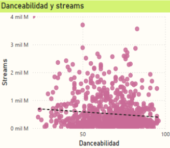
    - *Interpretación:* No hay correlación entre la danceability (bailabilidad) de la canción y el éxito de la misma.
- **Correlación Streams vs Valence:** 0.04137056

   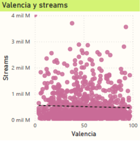
     - *Interpretación:* No hay correlación significativa entre el valence (positividad emocional) de la canción y el éxito de la misma.
- **Correlación Streams vs Energy:** -0.0252682
  
    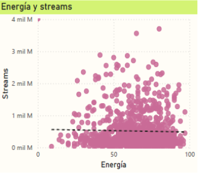
    - *Interpretación:* No hay correlación entre la energía de la canción y el éxito de la misma.
- **Correlación Streams vs Acousticness:** -0.025737
  
   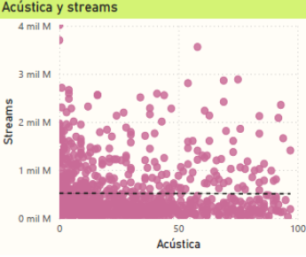
    - *Interpretación:* No hay correlación entre el acousticness (acústico) de la canción y el éxito de la misma.
- **Correlación Streams vs Instrumentalness:** -0.04423449
  
   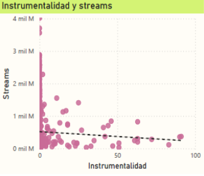
    - *Interpretación:* No hay correlación entre el instrumentalness (instrumental) de la canción y el éxito de la misma.
- **Correlación streams_liveness:** -0.01948088
  
   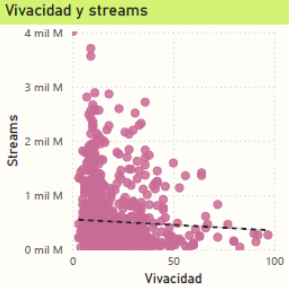
    - *Interpretación:* No hay correlación entre el liveness (vivacidad) de la canción y el éxito de la misma.
- **Correlación Streams vs Speechiness:** -0.11276317
  
   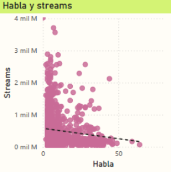
    - *Interpretación:* No hay correlación entre el speechiness (hablabilidad) de la canción y el éxito de la misma.

En resumen, la tabla muestra que hay correlaciones significativas entre el éxito de las canciones en Spotify y su presencia en otras plataformas (Deezer, Apple Music, Shazam), así como la inclusión en playlists y el número total de canciones de un artista. Sin embargo, no hay correlación significativa entre las características musicales específicas de las canciones (como bpm, danceability, valence, energy, etc.) y su éxito.

## Prueba de Significancia
## Relación entre BPM y Éxito de Canciones en Spotify
**Planteamiento de Hipótesis**

-*Hipótesis Nula (H0):* Las canciones con un mayor BPM (Beats Por Minuto) tienen más éxito en términos de streams en Spotify.

-*Hipótesis Alternativa (H1):* Las canciones con un mayor BPM no tienen más éxito en términos de streams en Spotify.

Para evaluar nuestras hipótesis, seleccionamos un nivel de confianza del 95% (α = 0.05). Utilizamos dos pruebas estadísticas según la distribución de nuestros datos:
- **Prueba t de Student:** Para comparar la diferencia de medias entre dos grupos con distribución normal.
- **Prueba U de Mann-Whitney:** Para comparar dos grupos cuando no se cumple la suposición de normalidad.

En resumen, los resultados indican que la cantidad de streams (alta o baja) no parece tener un impacto significativo en los BPM de las canciones analizadas.

  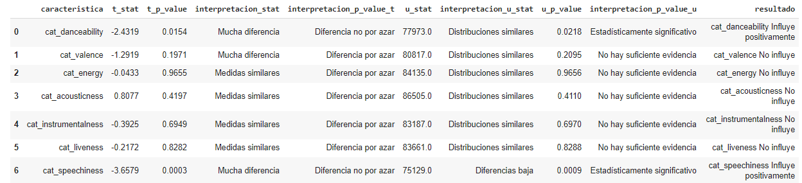

Se presentan estadísticas descriptivas de diferentes características musicales basadas en los datos de streams, útiles para analizar patrones en el comportamiento y preferencias de streaming musical:

- Tiempo: Velocidad o ritmo de la música.
- Energía: Intensidad y actividad percibida.
- Danceability: Facilidad con la que se puede bailar al ritmo de la música.
- Loudness: Volumen general de la música.
- Valence: Positividad transmitida por la música.
- Acousticness: Nivel de acústica o sonidos no amplificados.

## Conclusiones y recomendaciones
- **Presencia en Listas de Reproducción:** Aparecer en diversas listas de reproducción y rankings musicales aumenta la visibilidad de la canción y facilita que llegue a un público más amplio. Esto puede lograrse mediante la colaboración con curadores de listas y utilizando estrategias de marketing digital.

- **Colaboración con Artistas Reconocidos:** Trabajar con artistas que tienen un amplio repertorio y reconocimiento puede atraer a sus seguidores existentes y añadir credibilidad a la nueva canción. Las colaboraciones pueden crear sinergias y abrir nuevas oportunidades para el crecimiento de la audiencia.

- **Disponibilidad en Múltiples Plataformas:** Asegurar que la canción esté disponible en varias plataformas de streaming (como Spotify, Apple Music, Deezer, etc.) maximiza su accesibilidad y alcance. Esto permite a los oyentes encontrar y escuchar la canción en su plataforma preferida, lo que puede aumentar el número total de reproducciones y el impacto general de la canción.

## Recursos
### Presentación del Proyecto

## Google Colab Notebook
Puedes acceder a mi notebook en Google Colab haciendo clic [aquí](https://colab.research.google.com/drive/17cAeL7ujk76bEFqak3T37nXNFNcJIhUu#scrollTo=jBcSpuqunEbR).

## Dashboard de Power BI

Puedes acceder al PDF de mi dashboard de Power BI haciendo clic [aquí](https://acrobat.adobe.com/id/urn:aaid:sc:us:393df085-797b-488d-86f8-1acccc701472).

